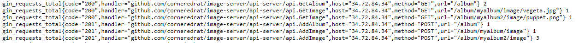

# image-server
Server that provides apis to create/get/delete albums, and images inside them.
You can find the detailed description of server in `api-server` folder.

## Index
- [Installation/Deployment](#installation)
- [Customizing deployment](#customize)
- [Viewing Metrics](#metrics)

<a name="Installation"></a>
## Installation
> Prerequisites: You would need a cluster in which this service can be deployed.
- Deploy init set of comonents
```
# Create a namespace
kubectl create namespace imgserver

# Apply the init set of manifests
# This deploys required necessary basic components
kubectl apply -f release-manigest-init.yaml -n imgserver

# Wait for a while, so that svc of the image service has a loadBalncer IP
kubectl get svc -n imgserver
# \--------> note down the svc's public IP
```
- Update api-server/main.go (line number 25) to change URL. this is important for swagger-ui to work.
```
// @host localhost:8080             <---------change this
// @host <loadbalancer-ip>          <---------like this
```
- build docker image
```
cd api-server
sudo docker build . -t <my-docker-registry-url>/<image-name>:<image-tag>
sudo docker push <my-docker-registry-url>/<image-name>:<image-tag>
```
*note down the image uri, to replace it in release-manifest.yaml*
- update docker image name in release-manifest.yaml (line number 23)
```
        image: raghunandanbs/imageserver:v4                         <------------------ change this
        image: <my-docker-registry-url>/<image-name>:<image-tag>    <------------------ like this 
```
- deploy image server to cluster
```
kubectl apply -f release-manifest.yaml  -n imgserver
```
<a name="customize"></a>
## Customising deployment
Set environment variables in release-manifest.yaml for the image-server container, to use your own DB and KAFKA servers. Enironment variables that can be set: 
```
MONGO_URL
MONGO_PORT
KAFKA_URL
KAFKA_PORT
```
(refer to api-server/config/init.go line 49-60 for more details)
<a name="metrics"></a>
## Viewing metrics
To view metrics, go the IP address seen in the svc, and add /metrics as uri tail.
After performing some API calls, you can see metrics as shown below:

