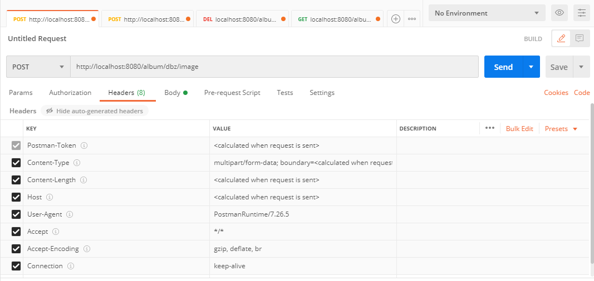
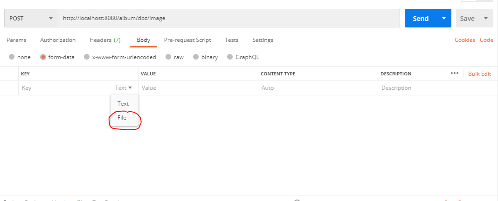
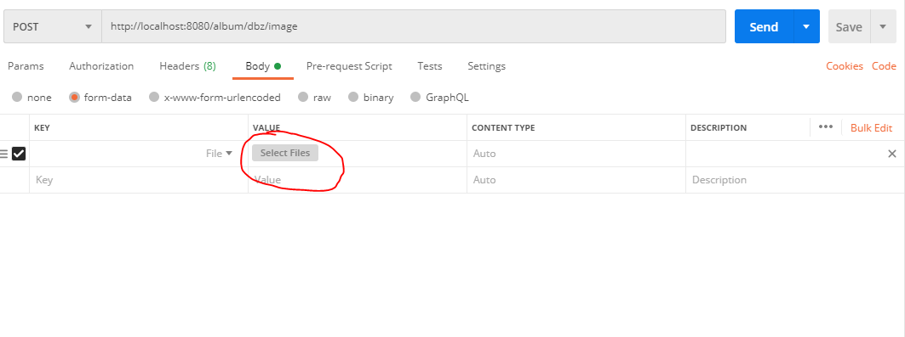

# A server that serves http requests to POST and GET images and albums

### build steps
```
# Install depedancy
go mod vendor

# Download gin-swaggo and generate documentation-json
go get -u github.com/swaggo/swag/cmd/swag
swag init

# LINUX:
go build -m vendor -o server
# WINDOWS: 
go build -m vendor -o server.exe
```

# Run server:
```
# Linux:
./server
# Windows:
.\server.exe
```

# APIs supported:

to check the APIs that are supported, please head over to `<url>/swagger/index.html`

Unfortunately, I havent figured out how to upload an image via swagger UI, So heres screenshots on how a file can be sent to this server:
### Steps
> Prerequisutes : You need to have created an album in the first place, to upload an image.
- In postman, select method as post, Make sure the headers are right (default ones should work).

- Under body, select mime type as formdata, and under key, select type as file.

- Select file from your file system, and click on send.
