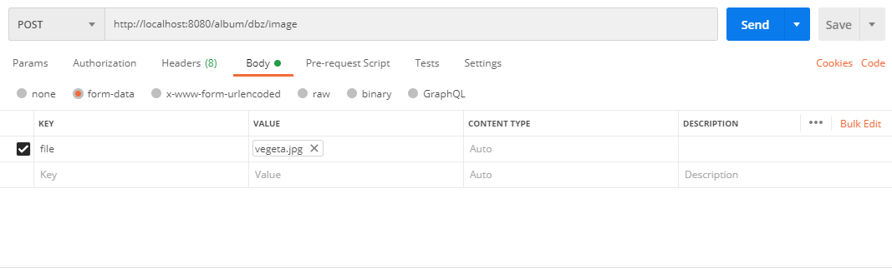

# A server that serves http requests to POST and GET images and albums

## Index
- [Build steps](#bld-steps)
- [Customising configuration](#customize)
- [Running the application](#run-steps)
- [How data is Handled](#data-handling)
- [APIs/Usage Info](#api-usage)
- [My Comments](#comments)
<a name="bld-steps"></a>
## build steps
```
# Install depedancy
go mod vendor

# Download gin-swaggo and generate documentation-json
go get -u github.com/swaggo/swag/cmd/swag
swag init

# LINUX:
go build -m vendor -o server
# WINDOWS: 
go build -m vendor -o server.exe
```
<a name="customize"></a>
## Customising configuration
In path config/config.yaml, customise values based on your needs, and run the server. Here is an example:
```
server:
  listenPort:  8080
  bindAddress: 0.0.0.0
database:
  url: mongo
  port: 27017
imageDir: images
kafka:
  url: fake.kafka.domain
  port: 9092
imagePath: image
```

<a name="run-steps"></a>
## Run server:
```
# Linux:
./server
# Windows:
.\server.exe
```

<a name="data-handling"></a>
## Data storage and handling
- MongoDB used to store information about albums and images
- filesystem is used to store images. Their name is replaced with their hash.
    for example, if file name is image.jpg, it'll be stored as d41d8cd98f00b204e9800998ecf8427e.jpg, depending on its md5 hash.

#### Database
```
database: nokiatask
    |
    \___ Collection <album>
    |       |
    |       \__________________ name: album name (primary key)
    |       |                   images:
    |       |                       - name: image name (must be unique in this list)
    |       |                         hash: image hash
    |       |                       - name: another image name
    |       |                         hash: another image hash
    |       \__________________ name: another album name
    |                           images:
    |                               nil
    |                           ...
    |
    \___ Collection <image>
            |
            \__________________ name: image name
            |                   hash: image hash
            |                   counter: number of times this image is referenced (in different albums)
            |                   location: path to the image
            \__________________ ...

```
#### Filesystem
```
image/
    |
    \_____ d41d8cd98f00b204e9800998ecf8427e.jpg
    \_____ fb1287ef283cee79c1c9d610d17bb1a7.jpg
```

<a name="api-usage"></a>
## APIs supported:

to check the APIs that are supported, please head over to `<url>/swagger/index.html`

### Metrcs:
access metrics at `<url>/metrics`

### Uploading file
Unfortunately, I havent figured out how to upload an image via swagger UI, So heres screenshots on how a file can be sent to this server:
### Steps
> Prerequisutes : You need to have created an album in the first place, to upload an image.
- In postman, select method as post, Make sure the headers are right (default ones should work).

- Under body, select mime type as formdata, and under key, select type as file.

- Set key value as file, and Select file from your file system, and click on send.


<a name="comments"></a>
## My Comments:
#### Things that worked well:
- I've tried saving the file, using its md5 hash information. Because of this, even if duplicates of same image are added to different albums, it still refers to the same file in the file system.
#### What could've been done better.
- I've refrained from using panic and recover. I'm much well versed using errors as return values as a part of error handling and it helps me to finish the task faster.
- Functions can be optimised further. I haven't been faithful to "Do one thing, and do it well" concept. 
